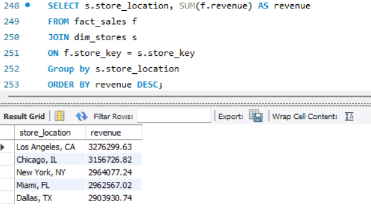
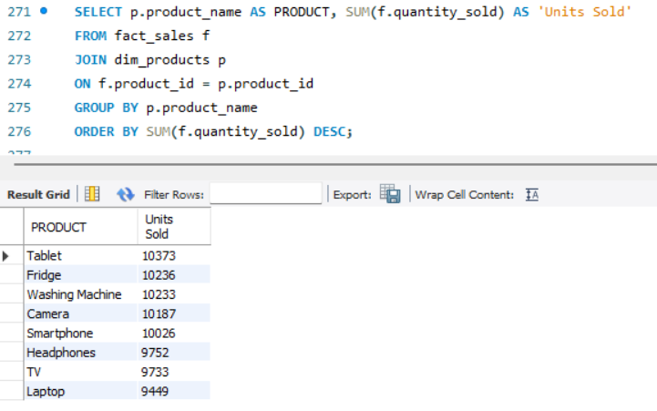

# Sales Data Analysis with SQL

## Overview
This project analyzes retail sales data from Walmart stores across the United States using SQL. The workflow includes data loading, validation, transformation, and exploratory data analysis to generate business insights.

## Dataset
The dataset was obtained from Kaggle and contains transactional data, customer information, product details, and external factors such as weather and promotions.

## Methodology
- Loaded raw CSV data into MySQL
- Performed data validation (duplicates, nulls, ranges)
- Designed and implemented a star schema:
  - fact_sales
  - dim_customers
  - dim_products
  - dim_stores
  - dim_external


## Key Business Questions

### 1. Which city has the highest revenue?
```sql
SELECT s.store_location, SUM(f.revenue) AS revenue 
FROM fact_sales f
JOIN dim_stores s 
ON f.store_key = s.store_key
GROUP BY s.store_location
ORDER BY revenue DESC;
```


This chart shows total revenue by store location. Los Angeles leads significantly, indicating strong regional performance.


### 2. Which product has the most sales?
```sql
SELECT p.product_name AS PRODUCT, SUM(f.quantity_sold) AS 'Units Sold'
FROM fact_sales f
JOIN dim_products p
ON f.product_id = p.product_id
GROUP BY p.product_name 
ORDER BY SUM(f.quantity_sold) DESC;
```


Tablets are the most sold product by units, highlighting strong demand in the electronics category.

### 3. Do special offers have good results?
```sql
SELECT promotion_applied,
       AVG(revenue) AS avg_revenue
FROM fact_sales
GROUP BY promotion_applied;
```

## Key Insights

- The Los Angeles store generates the highest total revenue, indicating strong regional performance and potential best practices to replicate across other locations.

- Tablets are the top-selling product by units, confirming high demand within the electronics category and suggesting opportunities for inventory and marketing optimization.

- Promotions are associated with higher average revenue per transaction, indicating a positive impact on sales performance.

- Sales tend to increase under rainy conditions, suggesting that external factors such as weather influence customer purchasing behavior.

- Platinum loyalty customers generate significantly higher revenue, highlighting the importance of customer retention strategies and loyalty programs.


## Notes on Data Quality

During the analysis, the following issues were identified:

- Non-unique product IDs across different products
- Weather data varying for the same date across locations

These issues required adjustments in the data model and highlight the importance of proper data validation and data modeling before analysis.


